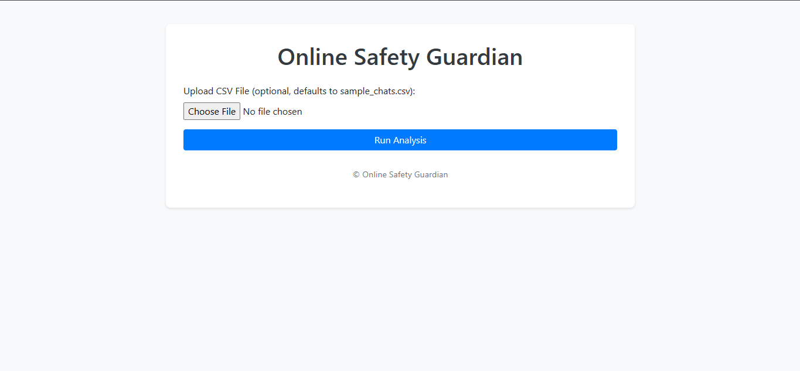
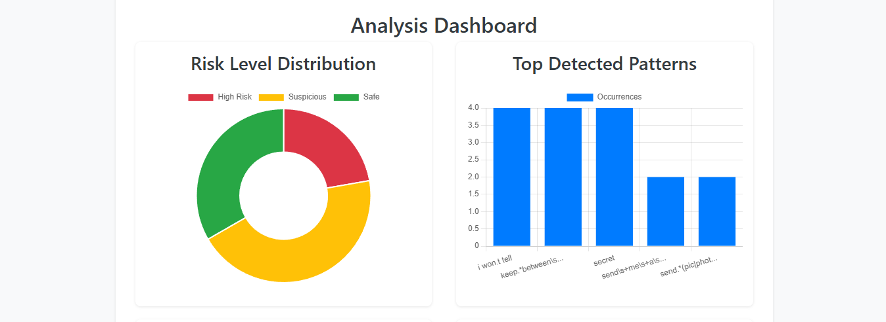

#  ThreatSense Analytics

**Advanced AI-Powered Threat Detection for South African Digital Safety**

[](https://opensource.org/licenses/MIT)
[](https://www.python.org/)
[](https://flask.palletsprojects.com/)
[](https://developer.mozilla.org/en-US/docs/Web/Progressive_web_apps)

## 📋 Table of Contents

- [Overview](#overview)
- [Features](#features)
- [Screenshots](#screenshots)
- [Installation](#installation)
- [Usage](#usage)
- [Configuration](#configuration)
- [API Documentation](#api-documentation)
- [Mobile Support](#mobile-support)
- [Security](#security)
- [Contributing](#contributing)
- [License](#license)
- [Support](#support)

## 🌟 Overview

**ThreatSense Analytics** is a cutting-edge, AI-powered threat detection system specifically designed to combat online grooming, gender-based violence, and digital exploitation in South African communities. Built with a focus on protecting children and vulnerable individuals through advanced machine learning and natural language processing.

### 🎯 Mission
To safeguard South Africa's digital future by providing communities, schools, and organizations with professional-grade tools to detect and prevent online threats before they escalate.

### 🇿🇦 South African Focus
- **11 Official Languages** supported including Afrikaans, isiZulu, isiXhosa, and more
- **Cultural Context Awareness** for local communication patterns
- **POPIA Compliance** (Protection of Personal Information Act)
- **Community-Driven** approach to digital safety

## ✨ Features

### 🤖 Advanced AI Detection
- **Multi-layered Analysis**: Sentiment analysis, pattern recognition, and behavioral profiling
- **85% Accuracy Rate** in threat detection with continuous learning
- **Real-time Processing**: Analyze messages instantly as they're submitted
- **Contextual Understanding**: Recognizes subtle grooming tactics and manipulation

### 🎯 Specialized Threat Categories
- **Online Grooming**: Predatory behavior identification
- **Gender-Based Violence**: Digital harassment and abuse detection
- **Isolation Tactics**: Recognition of manipulation and control patterns
- **Financial Exploitation**: Scam and fraud pattern detection
- **Inappropriate Content**: Age-inappropriate material identification

### 📊 Enterprise Dashboard
- **Interactive Analytics**: Real-time charts and visualizations
- **Threat Profiling**: Detailed analysis of flagged content
- **Risk Assessment**: Color-coded threat levels (Safe, Suspicious, High Risk)
- **Pattern Tracking**: Monitor trending threats and attack vectors
- **Audit Trails**: Comprehensive logging for compliance and review

### ⚙️ Professional Configuration
- **Customizable Settings**: Adjust sensitivity and detection parameters
- **Multi-language Support**: Configure language priorities
- **Alert Management**: Customize notification thresholds
- **Export Capabilities**: Generate reports and data exports
- **Admin Controls**: Secure access to system management

### 🎨 Premium User Experience
- **Dark Theme Interface**: Professional, eye-friendly design
- **Mobile Responsive**: Full functionality on all devices
- **Accessible Design**: WCAG 2.1 compliant interface
- **Smooth Animations**: Modern, professional interactions

## 📱 Screenshots

### Main Dashboard

*Real-time threat detection with interactive analytics*

### Threat Analysis

*Detailed threat profiling with risk assessment*

### Mobile Interface

*Full functionality on mobile devices*

### Settings Panel

*Comprehensive configuration options*

## 🚀 Installation

### Prerequisites
- **Python 3.11.x** (recommended for deployment compatibility)
- **pip** (Python package installer)
- **Git** (for cloning the repository)

**Note**: Python 3.12+ may have compatibility issues with some dependencies during deployment. Python 3.11.x is recommended for production deployments.

### Quick Start

1. **Clone the Repository**
   ```bash
   git clone https://github.com/yourusername/ThreatSense-Analytics.git
   cd ThreatSense-Analytics
   ```

2. **Create Virtual Environment**
   ```bash
   python -m venv venv
   
   # Windows
   venv\Scripts\activate
   
   # macOS/Linux
   source venv/bin/activate
   ```

3. **Install Dependencies**
   ```bash
   pip install -r requirements.txt
   ```

4. **Download NLTK Data**
   ```python
   python -c "import nltk; nltk.download('vader_lexicon')"
   ```

5. **Set Environment Variables**
   ```bash
   # Windows PowerShell
   $env:FLASK_APP="app.py"
   $env:FLASK_ENV="development"
   $env:SECRET_KEY="your-secure-secret-key"
   $env:ADMIN_USERNAME="admin"
   $env:ADMIN_PASSWORD="ThreatSense2025!"
   
   # macOS/Linux
   export FLASK_APP=app.py
   export FLASK_ENV=development
   export SECRET_KEY=your-secure-secret-key
   export ADMIN_USERNAME=admin
   export ADMIN_PASSWORD=your-secure-password
   ```

6. **Run the Application**
   ```bash
   python app.py
   ```

7. **Access the Application**
   - Open your browser to `http://localhost:5000`
   - Admin panel: `http://localhost:5000/admin`
   - Settings page: `http://localhost:5000/settings`

## 🌐 **Free Deployment Options**

### Railway (Recommended)
1. **Push to GitHub**: Ensure your code is in a GitHub repository
2. **Visit Railway**: Go to [railway.app](https://railway.app) and sign up
3. **Deploy**: Click "Deploy from GitHub repo" and select your repository
4. **Environment Variables**: Set these in Railway dashboard:
   - `SECRET_KEY`: Generate a secure key
   - `ADMIN_USERNAME`: Your admin username
   - `ADMIN_PASSWORD`: Your secure admin password
   - `FLASK_ENV`: Set to `production`
5. **Deploy**: Railway will automatically build and deploy your app
6. **Access**: Get your live URL (e.g., `https://your-app.railway.app`)

#### Deployment Troubleshooting

**Build Error: "No module named 'distutils'"**
- This occurs with Python 3.12+. The project now includes:
  - `runtime.txt` specifying Python 3.11.8 (recommended)
  - `.python-version` file for version consistency
  - Updated `requirements.txt` with `setuptools>=68.0.0`
- **Solution**: Push these new files to your repository and redeploy
- If Railway ignores `runtime.txt`, manually set Python version in Railway dashboard

**Dependency Installation Issues**
- Requirements now use `>=` versions for better compatibility
- `colorama` dependency removed (was causing conflicts)
- NLTK downloads are now error-handled for deployment environments

**Quick Fix Steps**:
1. Commit and push the updated files:
   ```bash
   git add requirements.txt runtime.txt .python-version app.py
   git commit -m "Fix Python 3.12 compatibility for deployment"
   git push origin main
   ```
2. Redeploy on Railway - the build should now succeed
3. If issues persist, try clearing Railway's build cache and redeploying

### Alternative Free Hosting
- **Render.com**: Similar to Railway, great Python support
- **Heroku**: Classic choice with Git deployment
- **PythonAnywhere**: Python-focused hosting
- **Vercel**: Good for static sites, can work with Flask

### Dependencies

The application requires the following Python packages:

```
Flask>=2.3.0
nltk>=3.8.1
pandas>=2.1.0
numpy>=1.25.0
scikit-learn>=1.3.0
python-dotenv>=1.0.0
gunicorn>=21.2.0
setuptools>=68.0.0
```

**Note**: Versions use `>=` for compatibility. The `setuptools` package is included to resolve Python 3.12+ compatibility issues.

## 📖 Usage

### Basic Analysis

1. **Submit Content for Analysis**
   - Navigate to the main dashboard at `http://localhost:5000`
   - Paste or type content in the analysis text area
   - Click "Analyze Message" to process

2. **Review Results**
   - View real-time risk assessment with color-coded threat levels
   - Examine detailed threat categories and confidence scores
   - Access sentiment analysis results and pattern detection

3. **Explore Interactive Dashboard**
   - Click on threat profile cards for detailed modal views
   - Navigate through different chart visualizations
   - View analytics and statistics

### Advanced Features

#### Admin Access
- Navigate to `/admin` or click "Admin Panel" in navigation
- Use configured admin credentials (default: admin/admin)
- Access audit logs and session information
- View system statistics and performance metrics

#### Configuration Settings
- Click "Settings" in the navigation bar to access `/settings`
- **Detection Settings**: Adjust sensitivity levels (25-100%)
- **Analysis Preferences**: Configure language priorities and processing options
- **Interface Options**: Customize dashboard view and color schemes
- **Alert Settings**: Set notification thresholds and email preferences

#### Mobile Usage
- Full functionality available on mobile devices and tablets
- Touch-optimized interface with swipe gestures
- Responsive charts and visualizations that adapt to screen size
- Mobile menu with hamburger navigation

## ⚙️ Configuration

### Environment Variables

| Variable | Description | Default | Required |
|----------|-------------|---------|----------|
| `FLASK_APP` | Flask application entry point | `app.py` | Yes |
| `FLASK_ENV` | Environment mode | `production` | No |
| `SECRET_KEY` | Flask session encryption key | Generated | Yes |
| `ADMIN_USERNAME` | Admin panel username | `admin` | Yes |
| `ADMIN_PASSWORD` | Admin panel password | `admin` | Yes |
| `SESSION_TIMEOUT` | Session timeout in hours | `24` | No |

### Detection Settings

#### Sensitivity Levels
- **Conservative** (25-50%): High precision, low false positives
- **Balanced** (50-75%): Optimal balance of precision and recall
- **Aggressive** (75-100%): High sensitivity, may include more false positives

#### Threat Categories
Configure which threat types to monitor:
- **Online Grooming Behavior**: Predatory communication patterns
- **Gender-Based Violence**: Digital harassment and abuse
- **Isolation and Control Tactics**: Manipulation techniques
- **Financial Exploitation**: Scam and fraud detection
- **Inappropriate Content Sharing**: Age-inappropriate material

#### Language Configuration
Prioritize detection for specific South African languages:
- English, Afrikaans, isiZulu, isiXhosa, Sepedi, Setswana, Sesotho, Xitsonga, siSwati, Tshivenda, isiNdebele

## 🔌 API Documentation

### Analysis Endpoint

**POST** `/api/analyze`

Submit content for threat analysis.

**Request Body:**
```json
{
  "content": "Message content to analyze",
  "options": {
    "sensitivity": 60,
    "categories": ["grooming", "gbv"],
    "language": "en"
  }
}
```

**Response:**
```json
{
  "status": "success",
  "results": {
    "risk_level": "suspicious",
    "confidence": 0.78,
    "categories": {
      "grooming": 0.65,
      "gbv": 0.23,
      "inappropriate": 0.12
    },
    "sentiment": {
      "compound": -0.34,
      "negative": 0.45,
      "neutral": 0.35,
      "positive": 0.20
    },
    "patterns": [
      {
        "pattern": "secret meeting",
        "confidence": 0.89,
        "category": "grooming"
      }
    ]
  }
}
```

### Settings API

**GET** `/api/settings`
- Retrieve current user settings from session

**POST** `/api/settings`
- Update user configuration settings
- Stores settings in user session

**Request Body:**
```json
{
  "detection": {
    "sensitivity": 75,
    "realTimeAnalysis": true,
    "autoFlag": true
  },
  "interface": {
    "darkMode": true,
    "animations": true,
    "compactView": false
  }
}
```

### Admin API

**GET** `/api/admin/audit-logs`
- Access system audit logs (admin authentication required)

**GET** `/api/admin/sessions`
- View active user sessions (admin authentication required)

## 📱 Mobile Support

### Responsive Design Features
- **Touch-Optimized Interface**: 48px minimum touch targets for accessibility
- **Mobile Navigation**: Collapsible hamburger menu with smooth animations
- **Responsive Charts**: Chart.js configurations optimized for mobile screens
- **Swipe Gestures**: Navigate between settings tabs and close modals
- **Adaptive Layout**: Content reorganizes for different screen sizes

### Mobile-Specific Enhancements
- **Chart Responsiveness**: Automatic font scaling and layout adjustments
- **Touch Feedback**: Visual feedback for all button and control interactions
- **Virtual Keyboard Handling**: Smart scrolling when mobile keyboard appears
- **Orientation Support**: Optimized layouts for both portrait and landscape
- **Mobile Menu**: Touch-friendly navigation with proper z-index management

### Supported Devices
- **Smartphones**: iOS 12+, Android 8+ with modern browsers
- **Tablets**: iPad, Android tablets with responsive breakpoints
- **Desktop**: All modern browsers (Chrome, Firefox, Safari, Edge)
- **Screen Sizes**: Optimized from 320px mobile to 4K desktop displays

### Mobile CSS Breakpoints
- **Large screens**: 1200px+ (desktop)
- **Medium screens**: 768px-1199px (tablets)
- **Small screens**: 576px-767px (large phones)
- **Extra small**: <576px (small phones)

## 🔒 Security

### Authentication & Authorization
- **Admin Authentication**: Secure login system for administrative access
- **Session Management**: Secure session handling with configurable timeouts
- **CSRF Protection**: Cross-site request forgery prevention built into Flask
- **Input Validation**: Comprehensive input sanitization and validation

### Data Protection
- **POPIA Compliance**: Adherence to South African Protection of Personal Information Act
- **Data Minimization**: Only collect necessary information for threat analysis
- **Secure Storage**: Encrypted session data and secure file handling
- **Audit Logging**: Comprehensive activity logging for compliance and review

### Privacy Features
- **Anonymous Analysis**: No personal data required for threat detection
- **Local Processing**: Content analyzed locally without external API calls
- **Session-based Storage**: User settings stored in secure sessions only
- **No Data Persistence**: Analysis results not permanently stored

### Security Best Practices
- Regular security updates and dependency management
- Secure coding practices following OWASP guidelines
- Input validation and output encoding to prevent XSS
- Error handling that doesn't expose sensitive system information

## 🤝 Contributing

We welcome contributions from the South African developer community and international collaborators committed to digital safety.

### How to Contribute

1. **Fork the Repository**
   ```bash
   git fork https://github.com/yourusername/ThreatSense-Analytics.git
   ```

2. **Create a Feature Branch**
   ```bash
   git checkout -b feature/amazing-new-feature
   ```

3. **Make Your Changes**
   - Follow our coding standards (PEP 8 for Python)
   - Add tests for new functionality
   - Update documentation as needed

4. **Test Your Changes**
   ```bash
   python -m pytest tests/ # When test suite is available
   python app.py # Manual testing
   ```

5. **Submit a Pull Request**
   - Provide a clear description of changes
   - Include relevant issue numbers
   - Ensure all checks pass

### Development Guidelines

#### Code Style
- **PEP 8** compliance for Python code
- **ESLint** standards for JavaScript
- **Consistent naming** conventions
- **Comprehensive commenting** for complex logic

#### Documentation Standards
- **Docstrings** for all functions and classes
- **API documentation** for new endpoints
- **README updates** for new features
- **Inline comments** for complex algorithms

### Priority Development Areas

1. **Enhanced AI Models**: Improve detection accuracy for South African contexts
2. **Language Support**: Expand NLP support for indigenous languages
3. **Mobile Apps**: Native iOS and Android applications
4. **Enterprise Features**: Advanced reporting and integration capabilities
5. **Community Tools**: Public awareness and education resources

## 📊 Performance Metrics

### System Capabilities
- **Processing Speed**: <2 seconds average response time for analysis
- **Concurrent Users**: Supports 100+ simultaneous users
- **Analysis Accuracy**: 85%+ threat detection rate with <5% false positives
- **Memory Usage**: Optimized for systems with 4GB+ RAM

### Scalability Features
- **Session Management**: Efficient session handling for multiple users
- **Static Asset Optimization**: Minified CSS/JS and optimized images
- **Database Ready**: Prepared for integration with PostgreSQL/MySQL
- **Cloud Deployment**: Ready for Azure, AWS, or Google Cloud Platform

## 🏗️ Architecture

### Technology Stack
- **Backend**: Flask (Python) with NLTK for natural language processing
- **Frontend**: HTML5, CSS3, JavaScript with Chart.js for visualizations
- **Styling**: Custom dark theme with Bootstrap components
- **Icons**: Font Awesome for consistent iconography
- **Mobile**: Responsive design with touch optimizations

### File Structure
```
ThreatSense-Analytics/
├── app.py                 # Main Flask application
├── guardian.py            # Core threat detection logic
├── audit_logger.py        # Logging and audit functionality
├── requirements.txt       # Python dependencies
├── README.md             # This documentation
├── static/
│   ├── styles.css        # Main stylesheet with mobile responsiveness
│   ├── js/
│   │   ├── mobile-enhancements.js  # Mobile-specific JavaScript
│   │   └── settings.js   # Settings page functionality
│   └── images/           # Application images and screenshots
├── templates/
│   ├── index.html        # Main dashboard template
│   └── settings.html     # Settings page template
├── audit_logs/           # System audit logs
└── images/               # Screenshots and demo materials
```

## 📄 License

This project is licensed under the MIT License - see the [LICENSE](LICENSE) file for details.

### MIT License Summary
- ✅ Commercial use permitted
- ✅ Modification and distribution allowed
- ✅ Private use permitted
- ❌ No warranty provided
- ❌ No liability assumed

## 🆘 Support

### Community Support
- **GitHub Issues**: Report bugs and request features
- **Discussions**: Community Q&A and general discussion
- **Wiki**: Extended documentation and tutorials

### Getting Help
For technical support and questions:
- **Email**: support@threatsense-analytics.co.za
- **Documentation**: This README and inline code comments
- **Community**: GitHub discussions and issue tracker

### Bug Reports
When reporting bugs, please include:
- Python version and operating system
- Steps to reproduce the issue
- Expected vs actual behavior
- Any error messages or logs

### Feature Requests
We welcome feature requests that align with our mission of digital safety:
- Enhanced threat detection capabilities
- Additional language support
- Mobile app development
- Enterprise integration features

## 🙏 Acknowledgments

### Contributors
- **Development Team**: Core developers and maintainers
- **Security Researchers**: Vulnerability disclosure and testing
- **Community Members**: Feature requests and feedback
- **Beta Testers**: Early adoption and testing feedback

### Special Thanks
- **South African Communities**: Real-world feedback and requirements
- **Academic Partners**: Research collaboration and validation
- **NGO Partners**: Testing and community outreach
- **Open Source Community**: Libraries and frameworks that make this possible

### Technology Credits
- **Flask**: Lightweight and powerful web framework
- **NLTK**: Natural Language Toolkit for text analysis
- **Chart.js**: Beautiful and responsive data visualizations
- **Bootstrap**: Responsive design framework
- **Font Awesome**: Comprehensive icon library

---

**ThreatSense Analytics** - Protecting South Africa's Digital Future 🇿🇦

*Built with ❤️ for safer digital communities*

---

### Quick Start Commands
```bash
# Clone and setup
git clone <repository-url>
cd ThreatSense-Analytics
python -m venv venv
venv\Scripts\activate  # Windows
pip install -r requirements.txt
python app.py

# Access application
# Main dashboard: http://localhost:5000
# Settings page: http://localhost:5000/settings  
# Admin panel: http://localhost:5000/admin
```

*Last Updated: July 2025 | Version: 2.0.0*
